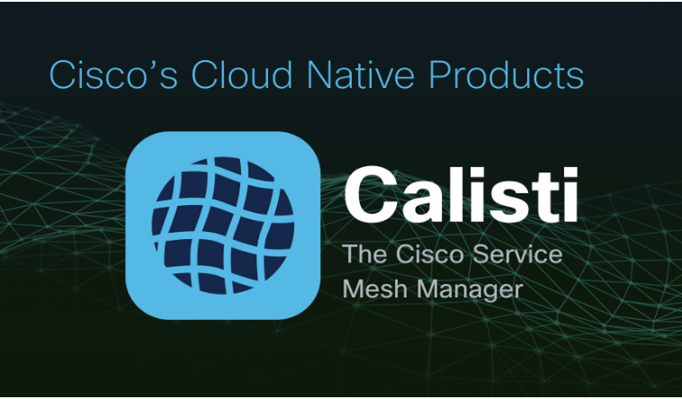

# Overview

A service mesh provides many benefits to Cloud Native applications, including observability, security, and load-balancing. However, mesh architectures present operators with several inherent challenges including lifecycle management, fragmented observability, and the complexity of enabling advanced use-cases, such as canary deployments, customized traffic management and circuit breakers. All these, and much more are solved by Calisti - our innovative solution.

Calisti includes the following main components:

**Service Mesh Manager** is a multi and hybrid-cloud enabled service mesh platform for constructing modern applications. Built on Kubernetes and our Istio distribution, Service Mesh Manager enables flexibility, portability and consistency across on-premise datacenters and cloud environments.

**Streaming Data Manager** is the deployment tool for setting up and operating production-ready Apache Kafka clusters on Kubernetes, leveraging a Cloud Native technology stack. Streaming Data Manager includes Zookeeper, Koperator, Envoy, and many other components hosted in a managed service mesh. All components are automatically installed, configured, and managed in order to operate a production-ready Kafka cluster on Kubernetes.