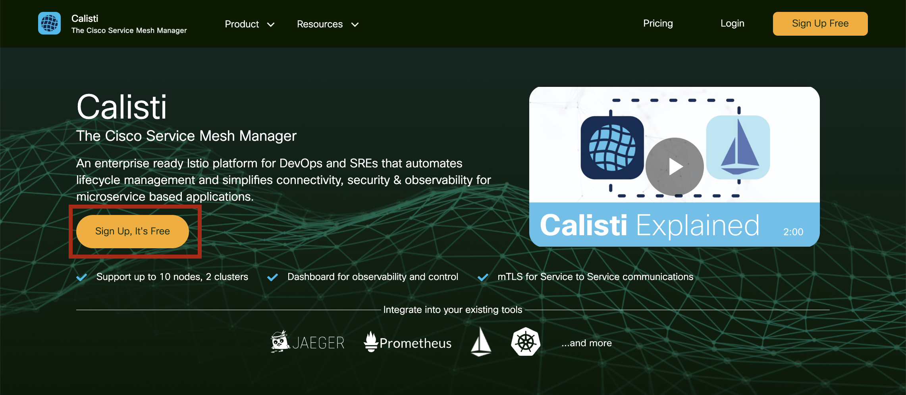
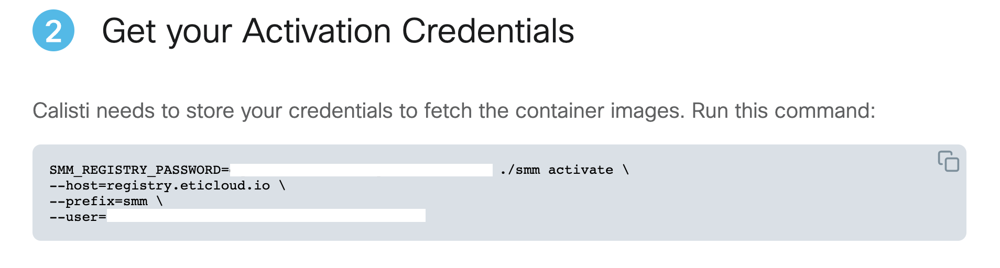
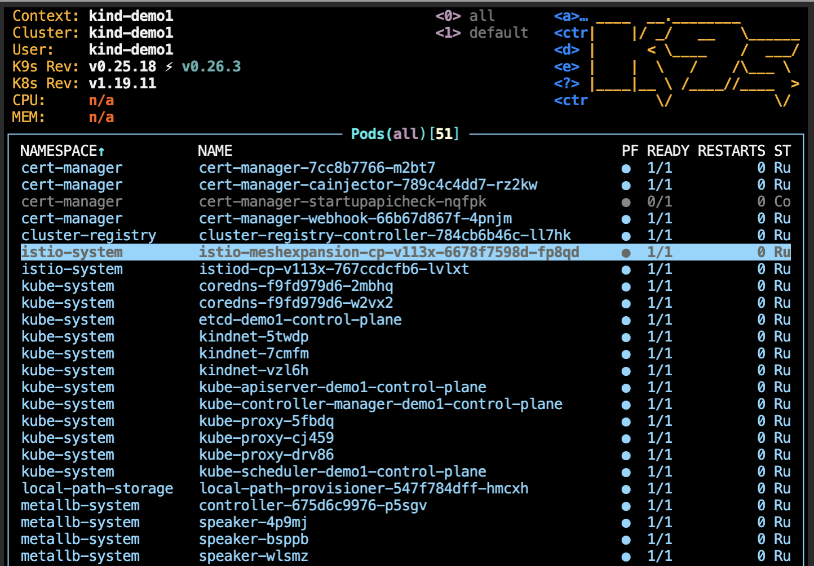

# Getting started

## Create a 5 node cluster
To setup the k8s cluster execute the following in the terminal.

```bash
$HOME/lab/cluster/cluster_setup.sh
```

This sets up a 5 node cluster with metallb as the k8s load-balancer controller in around 2-3 minutes.

### Kubernetes Checks

To check the status of the Kubernetes cluster, do the following:

Verify the cluster exists.  Expected output should show the `demo1` cluster.

```bash
kind get clusters
```
Get the list of nodes in the cluster. We should have 5.

```bash
kind get nodes --name demo1
```

Check the status of the pods running in the cluster.  All pods should be in "Running" state.

```bash
kubectl get pods -A
```

## Deploy Calisti

Navigate to https://calisti.app. Click on the “Sign up, It’s Free” button and proceed to register and download the Calisti linux binary.



After you downloaded the smm archive on your local computer please use the upload button to upload the file to the server. (file will be copied under $HOME/files)


Extract the smm and supertubes binaries and copy them to the system path
```bash
tar -xvf $HOME/files/smm_*
sudo cp ./smm /usr/bin
sudo mv ./supertubes /usr/bin
```

Please copy and paste the activation credentials command provided on the download page to the terminal.




Install Calisti and expose dashboard (the installation will take around 5 min)
```bash
smm install --non-interactive -a --install-sdm -a --additional-cp-settings $HOME/lab/config/smm/enable-dashboard-expose.yaml
```

After the installation finishes you can check the Calisti SMM cluster status:

```bash
smm istio cluster status -c ~/.kube/demo1.kconf
```

The expected output should show something similar to this:

```
eti-lab> smm istio cluster status -c ~/.kube/demo1.kconf
✓ validate-kubeconfig ❯ checking cluster reachability...
✓ validate-version ❯ checking K8s API server version...
✓ validate-version ❯ detected K8s API server version: 1.23.13
logged in as kubernetes-admin
Clusters
---
Name        Type   Provider  Regions  Version   Distribution  Status  Message  
kind-demo1  Local  kind      []       v1.23.13  KIND          Ready            


ControlPlanes
---
Cluster     Name                        Version  Trust Domain     Pods                                                  Proxies  
kind-demo1  cp-v115x.istio-system       1.15.3   [cluster.local]  [istiod-cp-v115x-58667c6fc9-ct92b.istio-system]       22/22 
```

Please wait to have all the Pods in Running or Completed status

```bash
kubectl get pods -A
```

You can also have an overview of the cluster using k9s - a terminal based UI to interact with your Kubernetes cluster.

```bash
k9s
```


(press Ctrl+c to exit)


### Deploy the demo app

Wait to have all the pods in Running state then
```bash
smm demoapp install --non-interactive
```

## Dashboard

Service Mesh Manager provides a dashboard interface that can be used to diagnose any issues with the underlying deployment.

### Expose dashboard

In order to be able to access the Calisti dashboard we need to enable a reverse-proxy 
```bash
INGRESSIP=$(kubectl get svc smm-ingressgateway-external -n smm-system -o jsonpath="{.status.loadBalancer.ingress[0].ip}")
caddy reverse-proxy --from :8080 --to ${INGRESSIP}:80 > /dev/null 2>&1 &
```

### Authenticate on the dashboard

For authenticating to the dashboard we will need an authentication token which is generated using the smm login command

```bash
smm login --non-interactive
```

Please copy the generated token and paste in the dedicated field when opening the [DASHBOARD](http://dashboard.location.hostname:8080) in your browser. Note that the token has a limited validity in time, so if you encounter any errors please re-generate & retry.


[DASHBOARD](http://dashboard.location.hostname:8080)