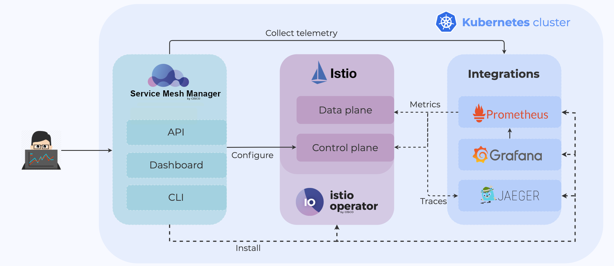

# Service Mesh Manager

## Overview

Service Mesh Manager is a multi and hybrid-cloud enabled service mesh platform for constructing modern applications. Built on Kubernetes and our Istio distribution, Service Mesh Manager enables flexibility, portability and consistency across on-premise datacenters and cloud environments.

Service Mesh Manager helps you to confidently scale your microservices over single- and multi-cluster environments and to make daily operational routines standardized and more efficient. The componentization and scaling of modern applications inevitably leads to a number of optimization and management issues:

How do you spot bottlenecks? Are all components functioning correctly?
How are connections between components secured?
How does one reliably upgrade service components?
Service Mesh Manager helps you accomplish these tasks and many others in a simple and scalable way, by leveraging the Istio service mesh and building many automations around it.

### Architecture

 The open source Cisco Istio operator helps to install/upgrade/manage Istio deployments. Its unique features include managing multiple ingress/egress gateways in a declarative fashion, and automated and fine-tuned multi-cluster management.

The core components of Service Mesh Manager are:

 - the Service Mesh Manager backend (exposing a GraphQL API)
 - the Service Mesh Manager UI, a web interface
 - the Service Mesh Manager CLI
 - the Service Mesh Manager operator
  
Service Mesh Manager’s soul is its backend, which exposes a GraphQL API. The Service Mesh Manager UI (dashboard) and CLI interact with this API. The Service Mesh Manager operator is an optional component which helps with a declarative installation method to support GitOps workflows.

External out-of-the-box integrations:

- Prometheus
- Grafana
- Jaeger
- Cert manager
  
Calisti Service Mesh Manager automatically installs and configures these components by default to be able to work with Istio but can also integrate with your own Prometheus, Grafana, Jaeger or Cert manager.

