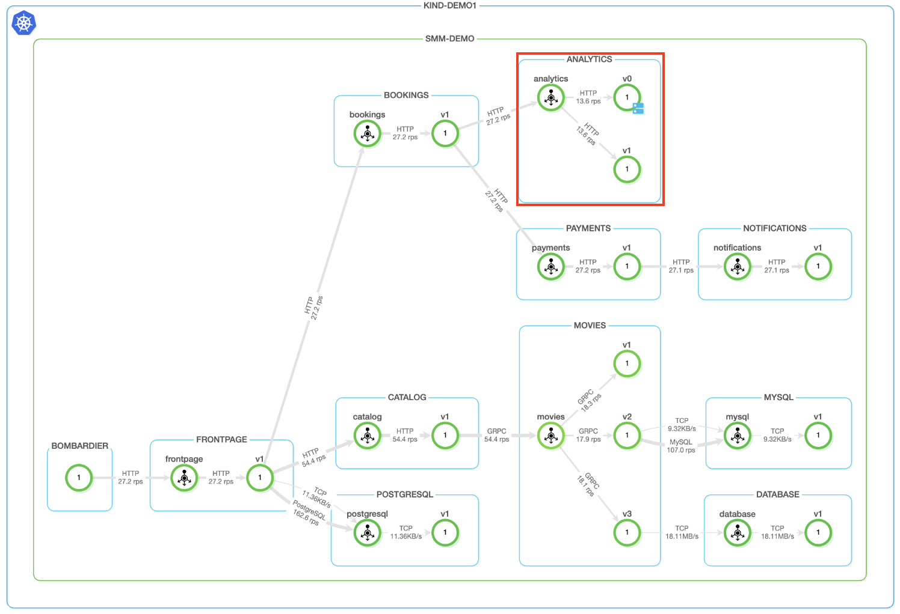
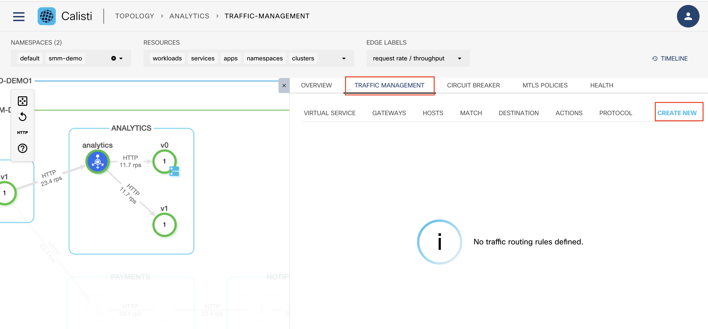
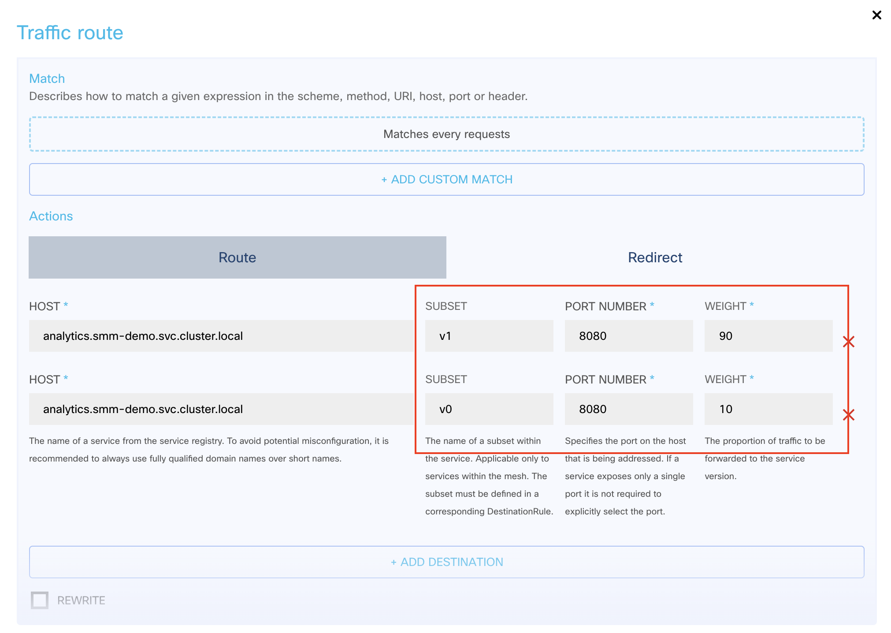
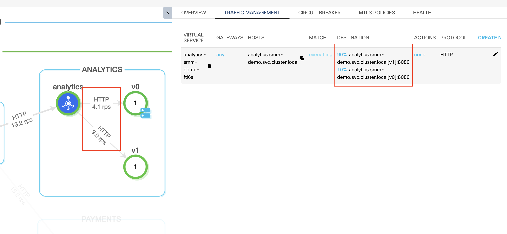

## VM Integration

Istio service mesh primarily provides its features to Kubernetes-based resources. However, in some cases it makes sense to integrate external compute nodes like bare metal machines or virtual machines into the mesh:

- temporary integration: To migrate the non-k8s native workloads into the mesh, providing temporary access to the machine’s network resources until the migration is done.
- long-term integration: Sometimes is impractical to migrate the given workload into Kubernetes due to its size (for example, when huge, bare metal machines are required) or when the workload is stateful and it is hard to support it on Kubernetes.
Service Mesh Manager provides support for both use-cases building on top of Istio’s support for Virtual Machines.

As a new compute we will deploy a new container external to the k8s cluster which will also run the **analytics** service and we will integrate it into the service mesh.

### VM access to your cluster

Istio can work in two distinct ways when it comes to network connectivity:

 - If the virtual machine has no direct connection to the pod’s IP addresses, it can rely on a meshexpansion gateway and use a different network for its workload group
 - If the virtual machine can access the pod’s IP addresses directly, then it can use the same network as Istio

The following example covers the same netowrk approach.


### Check Service Mesh network

Check which network the existing Istio control planes are attached to

```bash
kubectl get istiocontrolplanes -A
```
Output should be similar to
```console
NAMESPACE      NAME       MODE     NETWORK    STATUS      MESH EXPANSION   EXPANSION GW IPS     ERROR   AGE
istio-system   cp-v115x   ACTIVE   network1   Available   true             ["172.18.250.1"]           16m
```

Istio is using the network1 network name, so set the WorkloadGroup’s network setting to network1 as we use the same network model.

### Define workload group with same network

Create the workload group definition with network1:

```bash
cat > workload-analytics.yaml <<EOF
  apiVersion: networking.istio.io/v1alpha3
  kind: WorkloadGroup
  metadata:
    labels:
      app: analytics
      version: v0
    name: analytics-v0
    namespace: smm-demo
  spec:
    metadata:
      labels:
        app: analytics
        version: v0
    probe:
      httpGet:
        path: /
        host: 127.0.0.1
        port: 8080
        scheme: HTTP
    template:
      network: network1
      ports:
        http: 8080
        grpc: 8082
        tcp: 8083
      serviceAccount: default
EOF
```

### Deploy the workload group

Deploy the workload group by applying the definition file:

```bash
kubectl apply -f workload-analytics.yaml 
```

```console
workloadgroup.networking.istio.io/analytics-v0 created
```

### mTLS settings

After Istio is started on the virtual machine, Istio takes over the service ports defined in the WorkloadGroup resource. Depending on the settings, it will also start enforcing mTLS on those service ports.

If external (non-mesh) services communicate with the virtual machine, we need to ensure that communication without encryption is permitted on the service ports. To do so, create a PeerAuthentication object in the smm-demo namespace. Make sure that the matchLabels selector only matches the WorkloadGroup, and not any other Kubernetes deployment, to avoid permitting unencrypted communication where it’s not needed. In the following example, the matchLabels selector includes both the app and the version labels.
In order to allow VM to accept connections outside of the service mesh, we configure a peer authentication with permissive mode:

```bash
cat > permissive-mtls.yaml <<EOF
apiVersion: security.istio.io/v1beta1
kind: PeerAuthentication
metadata:
  name: analytics
  namespace: smm-demo
spec:
  mtls:
    mode: PERMISSIVE
  selector:
    matchLabels:
      app: analytics
      version: v0
EOF
```

Apply mTLS peer authentication:

```bash
kubectl apply -f permissive-mtls.yaml 
```

Check mTLS peer authentication:

```console
peerauthentication.security.istio.io/analytics created
```

Note that for the current example setting mTLS to permissive is optional, since the requests come from within the cluster.

### Deploy the "VM" as container

Run systemd ubuntu container as simulated "VM":

```bash
docker run -d --rm --privileged --cgroupns=host --name systemd-ubuntu --network=kind --tmpfs /tmp --tmpfs /run --tmpfs /run/lock -v /sys/fs/cgroup:/sys/fs/cgroup jrei/systemd-ubuntu 
docker exec -t systemd-ubuntu bash -c "apt-get -y update && apt-get install -y curl iptables iproute2 sudo"
VM_NAME=systemd-ubuntu
```

### Install http service in "VM"

Before we can register the virtual machine, the workload must already be running on the VM. The following instructions start an example HTTP server workload on the virtual machine, to simulate the analytics service.


Open a bash session on the simulated "VM":

```bash
docker exec -it ${VM_NAME} bash
```

Start fake analytics service inside the "VM":

```bash
# inside container
mkdir /empty_dir
cat <<EOF > /lib/systemd/system/smm-demo-analytics.service
[Unit]
Description=SMM demo app - analytics
After=network-online.target

[Service]
ExecStart=/usr/bin/bash -c "cd /empty_dir && /usr/bin/python3 -m http.server 8080"
KillMode=process
Restart=on-failure

[Install]
WantedBy=multi-user.target
EOF
ln -s /lib/systemd/system/smm-demo-analytics.service /etc/systemd/system/multi-user.target.wants/
systemctl start smm-demo-analytics.service
```

Ensure the pkg download cache is in the same filesystem as the target

```bash
# still inside container
mkdir /tmp/smm-agent
rm -rf /var/cache/smm-agent
ln -s /tmp/smm-agent /var/cache/smm-agent
exit
```
### Install the SMM agent on the "VM"

Service Mesh Manager takes an automation-friendly approach to managing the virtual machines by providing an agent that runs on the machine. This component enables Service Mesh Manager to provide the same observability features for virtual machines as for native Kubernetes workloads, such as Topology view, Service/Workload overview, integrated tracing, or traffic tapping.

The agent continuously maintains the configuration of the machine so that any change in the upstream cluster is reflected in its configuration. This behavior ensures that if the meshexpansion-gateways IP addresses change, the machine retains the connectivity to the mesh.

#### Collect information for smm-agent config

To attach the VM to the mesh, you’ll need the following information:

The URL of the dashboard
The namespace and name of the WorkloadGroup
The bearer token of the service account referenced in the .spec.template.serviceAccount of the WorkloadGroup
(Optional) The IP address that the clusters in the service mesh can use to access the VM. If this is the same as the IP the public internet sees for the VM, then Service Mesh Manager detects the VM’s IP automatically.

Get the container's IP on the docker network

```bash
NODEIP=$(docker exec -t ${VM_NAME} bash -c "ip a show dev eth0" | awk '$1 == "inet" {gsub(/\/.*$/, "", $2); print $2}')
echo $NODEIP
```

Get the ingress-gateway IP for Calisti

```bash
INGRESS_IP=$(kubectl get svc smm-ingressgateway-external -n smm-system -o jsonpath='{.status.loadBalancer.ingress[0].ip}')
echo $INGRESS_IP
```

Get the bearer token for the smm-demo namespace's service-account

```bash
SA_NAMESPACE=smm-demo
SA_SERVICEACCOUNT=default
SA_SECRET_NAME=$(kubectl get serviceaccount $SA_SERVICEACCOUNT -n $SA_NAMESPACE -o json | jq -r '.secrets[0].name')
BEARER_TOKEN=$(kubectl get secret -n $SA_NAMESPACE ${SA_SECRET_NAME} -o json | jq -r '.data.token | @base64d')
```

#### Deploy the smm-agent

Install the `smm-agent` in the VM

```bash
docker exec -t ${VM_NAME} bash -c "curl http://${INGRESS_IP}/get/smm-agent | bash"
```

#### Configure the smm-agent

Do the setup of the `smm-agent`

```bash
docker exec -t ${VM_NAME} bash -c "smm-agent set workload-group smm-demo analytics-v0"
docker exec -t ${VM_NAME} bash -c "smm-agent set node-ip ${NODEIP}"
docker exec -t ${VM_NAME} bash -c "smm-agent set bearer-token ${BEARER_TOKEN}"
```

#### Reconcile the smm-agent

Now that the workload is started on the VM (HTTP server) and smm-agent is configured, we can attach the VM to the mesh. To do so, run a reconciliation on this host. This step will:

- configure and start Istio, so the virtual machine becomes part of the mesh
- ensure that the cluster configuration is properly set
- start smm-agent in the background so that the system is always up-to-date


```bash
docker exec -t ${VM_NAME} bash -c "smm-agent reconcile"
```

```console
eti-lab> docker exec -t ${VM_NAME} bash -c "smm-agent reconcile"
✓ reconciling host operating system
✓ uuid not present in config file, new uuid is generated uuid=0327b100-a008-4364-a2b3-7d1777bb5b9a
✓ configuration loaded config=/etc/smm/agent.yaml
...
✓ wait-for-registration ❯ workloadentry is registered successfully
✓ changes were made to the host operating system
✓ reconciled host operating system
```

### Check "VM" connectivity


On the Calisti [dashboard](http://location.hostname:8080), navigate to MENU > TOPOLOGY and verify that the VM is visible (indicated by the blue icon on the workload) and that it is getting traffic. Pls
By default, traffic is load balanced between the different application versions.  Please wait until the number of requests is equaly distributed between v0 (VM) and v1 (pod).



### VM to Kubernetes migration
One of the common use cases is migrating an existing workload to the mesh (and Kubernetes). In order to accomplish this we have to complete the following main steps:
- Add the virtual machine to the mesh, so the original workload that is running in the virtual machine is available in the mesh. (we just accomplished this)
- Configure traffic shifting that will allow you to route traffic from the virtual machine to the Kubernetes workload.
- Add the Kubernetes workload that will replace the virtual machine.
- Shift traffic to Kubernetes gradually and test that the Kubernetes workload works properly, even under high load.
- Remove the virtual machine when you have successfully completed the migration.


### Traffic shifting
 Using the dashboard we can easily weight each destination to receive more or less traffic depending on the use case 




After a while you will see traffic decreasing on the VM side


Traffic should be gradually increased to the Kubernetes workload.

If the Kubernetes workload is handling 100% of the traffic without problems, we can then safely remove the VM (in this case the container) and also the traffic shifting rule(s).


### Delete the "VM"

The last step is to terminate the "VM":

```bash
$HOME/lab/end/vm_stop.sh
```
