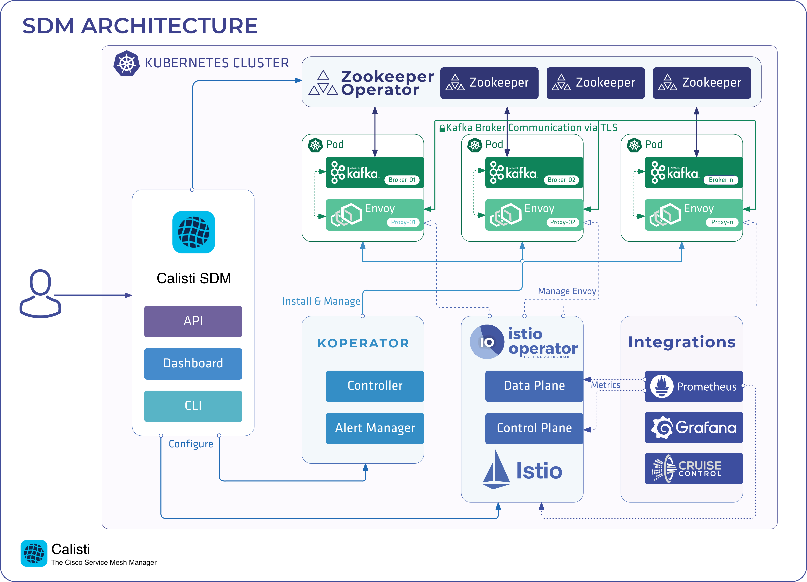

# Streaming Data Manager

## Overview

Calisti Streaming Data Manager is the deployment tool for setting up and operating production-ready Apache Kafka clusters on Kubernetes, leveraging a Cloud Native technology stack. Calisti Streaming Data Manager includes Zookeeper, Koperator, Envoy, and many other components hosted in a managed service mesh. All components are automatically installed, configured, and managed in order to operate a production-ready Kafka cluster on Kubernetes.

### Key Features

Some of the key features of Streaming Data Manager are:

- Fine-grained broker configuration support for heterogeneous cluster layouts.
- Declarative topic and user management through custom resources (CRs).
- Automatic, mTLS-based encrypted and authenticated communication between all Streaming Data Manager components.
- Advanced Grafana dashboards to monitor all Streaming Data Manager components.
- Automatic reaction and self-healing based on Prometheus alerts.
- Alert-based reactions for graceful up and downscaling and adding volumes to brokers.
- Disaster recovery using volume snapshots and cross-cluster replication using MirrorMaker2.
- Rolling upgrades for continuous operations.

### Architecture

Koperator is a core part of Calisti Streaming Data Manager that helps you create production-ready Apache Kafka cluster on Kubernetes, with scaling, rebalancing, and alerts based self healing. While the Koperator itself is an open-source project, the Calisti Streaming Data Manager product extends the functionality of the Koperator with commercial features (for example, declarative ACL handling, built-in monitoring, and multiple ways of disaster recovery).

### What makes Streaming Data Manager unique?

Calisti Streaming Data Manager is specifically built to run and manage Apache Kafka on Kubernetes. Other solutions use Kubernetes StatefulSets to run Apache Kafka, but this approach is not really suitable for Apache Kafka. Streaming Data Manager is based on simple Kubernetes resources (Pods, ConfigMaps, and PersistentVolumeClaims), allowing a much more flexible approach that makes possible to:

- Modify the configuration of unique Brokers: you can configure every Broker individually.
- Remove specific Brokers from clusters.
- Use multiple Persistent Volumes for each Broker.
- Do rolling upgrades without data loss or service disruption