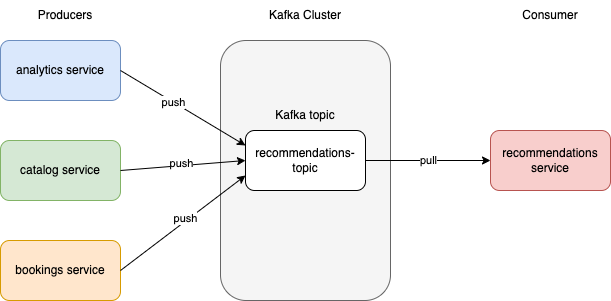
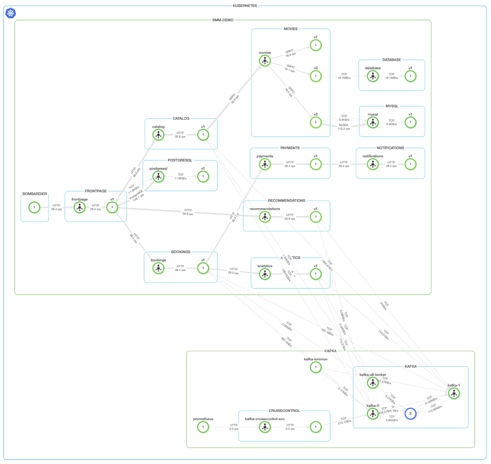
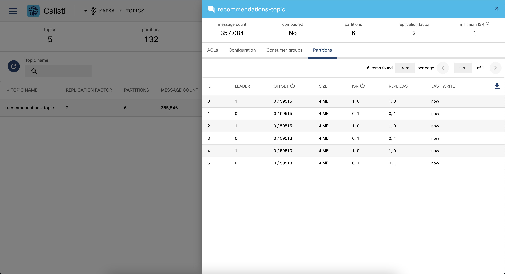
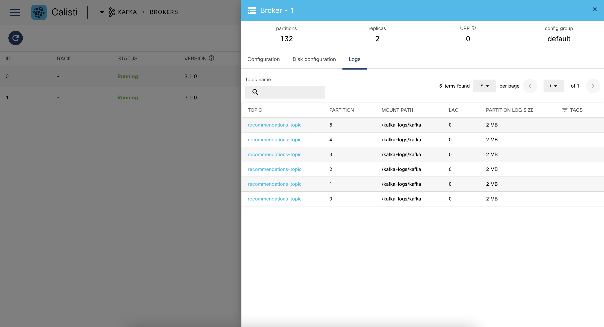
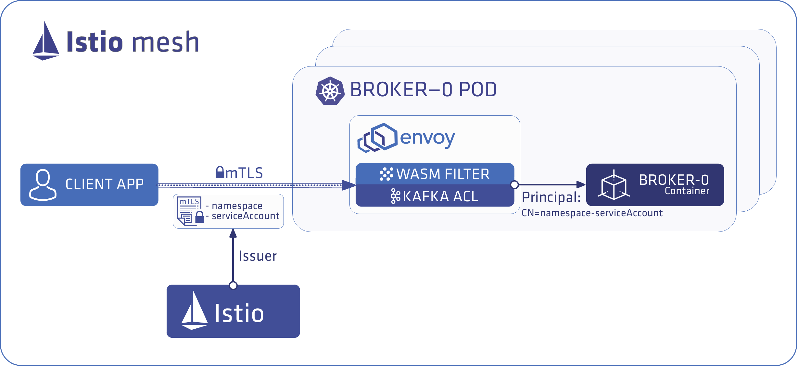

## Monitoring Kafka traffic with Calisti UI

### Demo app
We have a demo application in the cluster which includes multiple kafka brokers, as well as several producers which push data to a predefined kafkla topic  (analytics, catalog and booking services) as well as one consumer (recommendations service)

Navigate to the Topology page. In the Namespaces dropdown list top-left corner, select smm-demo and kafka namespaces. You will see the traffics between our Consumer service and the Producers services.

### Integrated SDM UI
There is an integrated SDM UI for us to check detailed information of Kafka Custom Resource objects we deployed.

The MENU > Topics topic page shows information about your Kafka Topics. In this following image, you can see that it shows offset and size for each Partition in recommendation-topic Topic. plot

The MENU > Brokers broker page shows information about your Kafka Brokers. Using the following image as an example, you can see that it shows the amount of partitions and log size for your Brokers. plot

## SSL-encrypted communication
Calisti Streaming Data Manager fully automates managed mutual TLS (mTLS) encryption and authentication. You don’t need to configure your brokers to use SSL, as Streaming Data Manager provides mTLS out-of-the box at the network layer (implemented through a light-weight, managed Istio mesh). All services deployed by Streaming Data Manager (Zookeeper, Koperator , the Apache Kafka cluster, Cruise Control, MirrorMaker2, and so on) interact with each other using mTLS.

If the client application is included into the managed light-weight Istio mesh used by Streaming Data Manager then the client application will interact with Kafka over mTLS out of the box, no SSL configuration is needed at the client application.
If the client application runs outside the managed mesh, the client application needs to be configured to use a client certificate that was signed by the same CA as what the mesh is using. Such a client certificate can be issued by executing supertubes istio certificate generate-client-certificate. Note that some additional configuration is needed in this scenario which is use case specific.
If the client application runs outside the Kubernetes cluster that hosts the Kafka cluster, the scenario is essentially the same as when the client application runs outside the managed mesh. The only difference is that the client application must connect to the external endpoint of the Kafka cluster instead of the internal endpoint which is only reachable from within the Kubernetes cluster.
