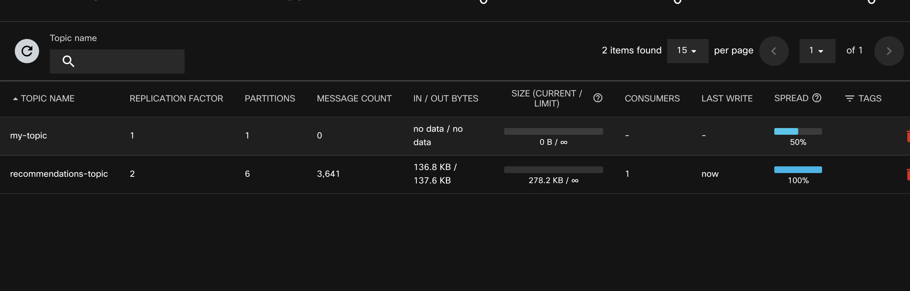
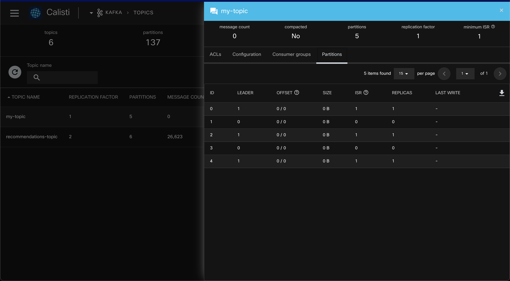

## Manage Kafka Topics Declaratively

Once you start running Kafka in production, an essential task will be managing topics, so producers and consumers can do their work.

Usually, you would use one of the Kafka command line tools to create and manage topics. While it is possible in a Kubernetes environment, it requires a few more steps, such as: 

- Find the correct pod
- Connect to the pod 
- Execute the appropriate command

While everything is fine with this approach, it is more difficult to reproduce a setup in disaster recovery or when standing up another (test) environment to mirror production.

Instead of connecting to specific brokers to create a new topic, we can use the `kubectl` command line interface. Here, we create a new topic declaratively using YAML.

**Our advantage**: We let Calisti do the heavy lifting, and we can save the YAML file in version control. 

### Create a new Kafka Topic via YAML

Run the following:

```bash
cat << EOF | kubectl apply -n kafka -f -
apiVersion: kafka.banzaicloud.io/v1alpha1
kind: KafkaTopic
metadata:
    name: my-topic
spec:
    clusterRef:
        name: kafka
    name: my-topic
    partitions: 1
    replicationFactor: 1
    config:
        "retention.ms": "604800000"
        "cleanup.policy": "delete"
EOF
```

We can then use the Dashboard to confirm the topic is present:



You might notice the `config:` key containing additional parameters in the code example above. 
If the new topic requires different configuration options, please refer to the [Kafka documentation](https://kafka.apache.org/documentation/#topicconfigs).

### Update a Kafka Topic via YAML

For instance, we'd like to update the partition count for a specific topic:

```bash
kubectl patch -n kafka kafkatopic my-topic --patch '{"spec": {"partitions": 5}}' --type=merge
```

The Calisti user interface reflects the updated setting:



