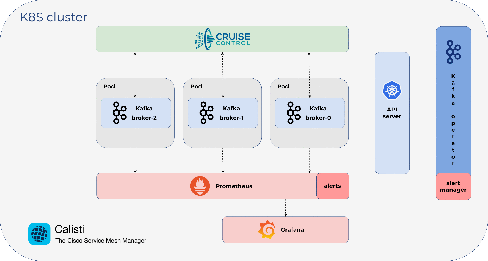

## Event-based scaling and self-healing
Calisti Streaming Data Manager exposes Cruise-Control and Kafka JMX metrics to Prometheus, and acts as a Prometheus Alert Manager. It receives alerts defined in Prometheus, and creates actions based on Prometheus alert annotations, so it can handle and react to alerts automatically, without having to involve human operators.

### Graceful Apache Kafka Cluster Scaling
To scale Kafka clusters both up and down gracefully, Calisti Streaming Data Manager integrates LinkedIn’s Cruise Control, and is configured to react to events. The three default actions are:

- upscale cluster (add a new Broker)
- downscale cluster (remove a Broker)
- add additional disk to a Broker
  
Additional, you can also define custom actions



### Vertical capacity scaling
There are many situations in which the horizontal scaling of a cluster is impossible. When only one Broker is throttling and needs more CPU or requires additional disks (because it handles the most partitions), a StatefulSet-based solution is useless, since it does not distinguish between replicas' specifications. The handling of such a case requires unique Broker configurations. If we need to add a new disk to a unique Broker, with a StatefulSet-based solution, we waste a lot of disk space (and money). Since it can’t add a disk to a specific Broker, the StatefulSet adds one to each replica.

Let's apply a policy which will trigger an alert on Prometheus whenever there is a broker which is not working for more than 30 seconds

```bash
kubectl apply -f- <<EOF
apiVersion: monitoring.coreos.com/v1
kind: PrometheusRule
metadata:
  creationTimestamp: null
  labels:
    prometheus: kafka-rules
    banzaicloud.io/managed-by: supertubes
  name: kafka-autoscale-rules
  namespace: kafka
spec:
  groups:
  - name: KafkaAutoscaleRules
    rules:
    - alert: BrokerUnderReplicated
      expr: kafka_server_replicamanager_underreplicatedpartitions_value > 0
      for: 30s
      labels:
        severity: alert
      annotations:
        description: 'broker underreplicated'
        summary: 'broker underreplicated'
        brokerConfigGroup: 'default'
        command: 'upScale'
EOF
```

This will have as effect the deployment of a new broker as soon as the alert is generated in Prometheus. 

In order to generate an allert, connect to one of the brokers and STOP the kafka process.

```bash
kubectl exec -it -n kafka "$(kubectl get pods --selector=app=kafka -n kafka -o jsonpath='{.items[0].metadata.name}')" /bin/bash
```
```bash
kill -STOP "$(ps -ef | grep '[j]ava' | awk '{print $2}')"
exit
```
After 1-2 mins there should be a new kafka broker being created.

To re-start the stopped broker:
```bash
kubectl exec -it -n kafka "$(kubectl get pods --selector=app=kafka -n kafka -o jsonpath='{.items[0].metadata.name}')" /bin/bash
```
```bash
kill -CONT "$(ps -ef | grep '[j]ava' | awk '{print $2}')"
exit
```

To downscale the number of brokers:
```bash
supertubes cluster broker remove --broker-id="$(kubectl get kafkacluster kafka -n kafka -o jsonpath='{.spec.brokers[0].id}')"
```
where broker-id is the broker id number (e.g 0 or 1 or similar). It takes 1-2 mins to see the changes. 

With Calisti Streaming Data Manager, adding a new disk to any Broker is as easy as changing a CR configuration. Similarly, any Broker-specific configuration can be done on a Broker by Broker basis.
